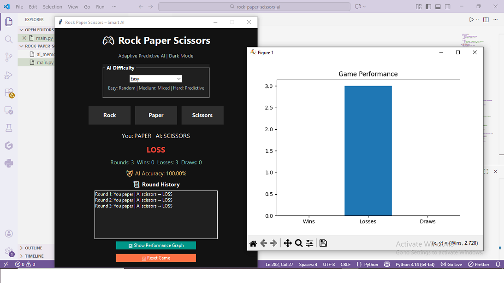
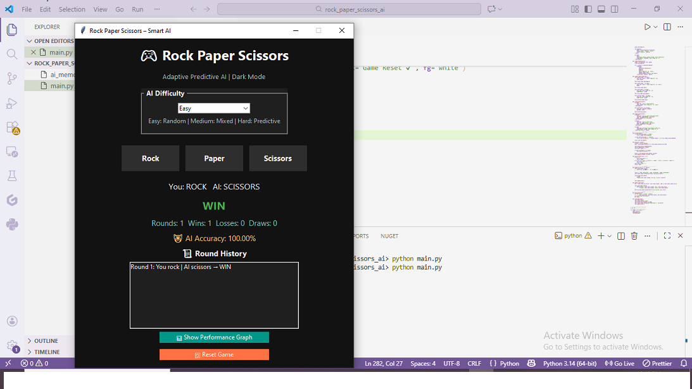

# rock-paper-scissors-smart-ai
Rock Paper Scissors game with Adaptive Predictive AI using Python &amp; Tkinter
# 🎮 Rock Paper Scissors – Smart AI

An interactive Rock Paper Scissors game built using **Python & Tkinter**, featuring an **adaptive predictive AI** that learns player behavior over time.

---

## 🚀 Features
- 🧠 Smart AI with learning memory
- 🎯 Difficulty Levels: Easy | Medium | Hard
- 🌙 Dark Mode UI
- 📜 Round history tracking
- 📊 Performance graph using Matplotlib
- 🤖 AI accuracy calculation

---

## 🛠 Tech Stack
- Python
- Tkinter
- Matplotlib
- JSON (AI Memory)

---

## 📸 Project Screenshots

### Game Interface


### Performance Graph


---

## ▶️ How to Run the Project
```bash
pip install matplotlib
python main.py
